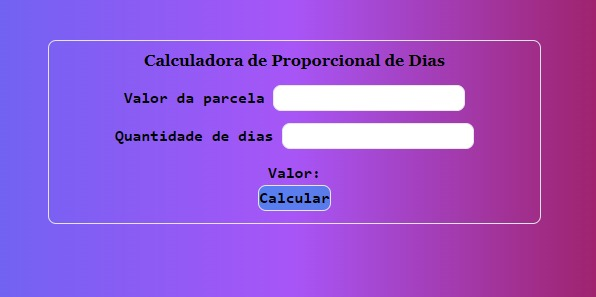
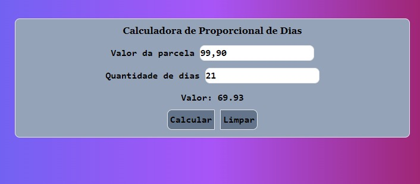
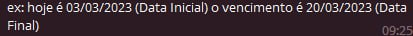
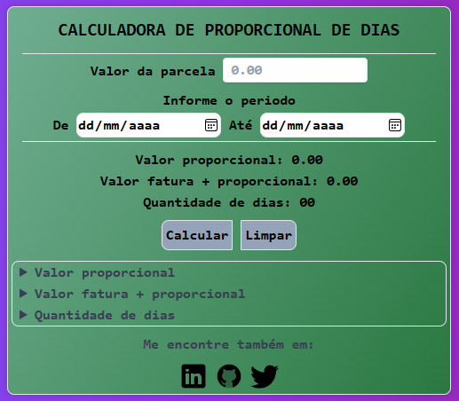

# Caucadora de Proporcional de Dias de Uso
Este é um projeto de uma calculadora proporcional de dias utilizados para serviços pós-pago como internet e streamers. A calculadora permite que você calcule a proporção de dias de utilização de serviço tendo como parâmetros a data inicial e a final de uso, considerando os dias úteis ou dias corridos.
### Tecnologias
- HTML
- JavaScript
- Tailwindcss

Utilize a aplicação do site [aqui](https://mauriciopreis.github.io/Caucadora_Proporcional_de_Dias/index.html)
#
## As versões da aplicação
### versão 1.0
Na primeira versão tínhamos apenas que entrar com dois parâmetros: o valor da parcela e a quantidade de dias, e logo a abaixo nos era entregue o valor proporcional da fatura que o cliente em questão deveria pagar porém com apenas um botão de calcular não havia libar campos se não apagasse ou recarregue a página assim como mostra a imagaguem a baixo.

### Versão 2.0
Na segunda versão do projeto foi feita a inclusão do botão Limpar que deixa os inputs(caixa de texto), e fois está a versão a ser implementada na empresa para ajudar os colaboradores assim sendo possível obter alguns feedbacks positivos dos colabores como mostrado abaixo, a versão e os feedback:

  
FeedBack

  
  FeedBack |
  :--------------- | 
   |
   |
   |
  

### Versão 2.6
Levando em consideração todos os feedbacks que foram reparados, foram feitas as modificações e incluídos uma explicação para os campos dos resultados com intuito de deixar a aplicação de melhor acessibilidade

### Melhorias futuras
- [ ] Inclusão de uma barra de navegação
  - Home
  - about
- [ ] Inclusão de modo escoro
- [ ] Melhoria na peleta de corres
